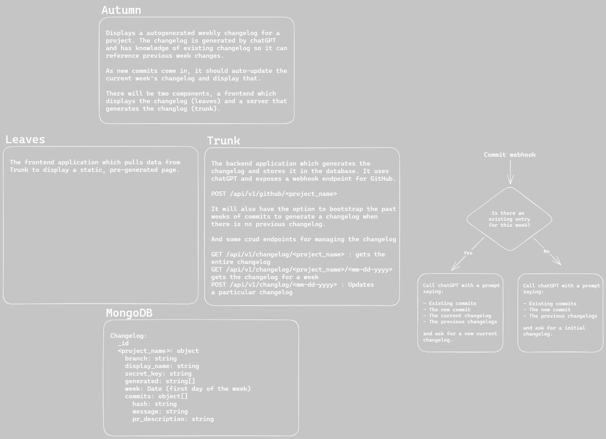

# Autumn-cl

Autumn-cl is an autogenerated changelog using GitHub PR/Commits to a specific branch of a repository. It uses GitHub webhooks and chatGPT to automatically make a weekly changelog for your repository.

[Demo](https://autumn-cl.com/)

## Contributing

All contributions will be made via the PR tab! Create a branch/fork, code your solution, link the supporting issue that the PR is for, and then make the PR on the GitHub tab.

## Runtime/Tools (Recommended version):

### Required

-   [Node](https://nodejs.org/en/) v19.3.0
-   NPM v9.2.0 (Comes with Node)

### Recommended

-   [NVM Windows](https://github.com/coreybutler/nvm-windows) v1.1.9 (Project Management)
-   [NVM Linux](https://github.com/nvm-sh/nvm) v0.39.1 (Project Management)
-   [Docker](https://www.docker.com/) v20.10.16 (Deployment)
-   [Flyctl](https://fly.io/) (Deployment)

## Technologies:

### Frontend:

-   [Astro](https://astro.build/) - Main Framework
-   [TypeScript](https://www.typescriptlang.org/docs/) - Main language
-   Additional:
    -   [Vanilla](https://developer.mozilla.org/en-US/docs/Web/JavaScript)
    -   [React](https://reactjs.org/)

### Backend:

-   [Astro](https://astro.build/) - Main Framework
-   [TypeScript](https://www.typescriptlang.org/docs/) - Main language

### Deployment

-   [Docker](https://www.docker.com/) - To make stable and reliable VM's for deployment
-   [Flyctl](https://fly.io/docs) - Deployment software that hosts website
-   [YAML](https://yaml.org/) - Formatting of the configuration for deployment

## Development

-   Git clone this repository.
-   Run `npm install` in the root directory with this project's package.json.
-   Run `npm run dev` to start the project.

## Deployment Web

Every time a commit happens on main, deployment will happen automatically. If you need to manually deploy, go to the directories with a `fly.toml` and run:

```bash
flyctl deploy
# Or
fly deploy
```

## Architecture


